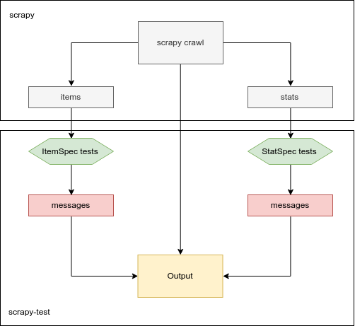

# scrapy-test

Scrapy test is a validation/test framework for validating scrapy results. 
This framework is capable of testing scrapy crawl and stats output.

See [example](example/readme.md) project for hackernews crawler with full test suite.

# Philosophy and Architecture



`scrapy-test` tries to replicate `scrapy.Item` definition but instead of defining fields it defines test for every field.  
Tests are callables that either returns a failure message if some condition is met. 
Example item specification:

```
class MyItem(Item):
    name = Field()
    url = Field()

class TestMyItem(ItemSpec):
    item_cls = MyItem
    
    # define tests
    name_test = Match('some-regex-pattern')
    url_test = lamda v: 'bad url' if 'cat' in v else ''
    
    # define coverage
    url_cov = 100  # 100% - every item should have url field
```

`scrapy-test` also supports stats output validation. When scrapy finished crawling it outputs various stats like error count etc. `StatSpec` can be defined to validate these stats:

```
class MyStats(StatsSpec):
    spider_cls = MySpder1, MySpider2
    # or multiple spiders
    validation = {  #stat_name_pattern : tests
        'item_scraped_count': MoreThan(1),
        'downloader/response_status_count/50\d': LessThan(1),
    }
    # required stat keys
    required = ['stat_pattern.+']
```

Finally `scrapy-test` determines failure by asserting if there are any messages generated by either stat ir item specifications (exit code 1 and 0 respectively).


# Usage

## Setup

1. `test.py` module should be created in spider directory.  
For example creating `test.py` 

    ```
    scrapy-test-example/
    ├── example
    │   ├── __init__.py
    │   └── test.py
    └── scrapy.cfg
    ```

2. Add test file config to `scrapy.cfg`:

    ```ini
    [settings]
    default = example.settings
    [test]
    root = example.test 
    ```

3. Define `ItemSpec` for item field validation:

    ```python
    from scrapytest.tests import Match, Equal, Type, MoreThan, Map, Len, Required
    
    class TestPost(ItemSpec):
        # defining item that is being covered
        item_cls = PostItem
        
        # defining field tests
        title_test = Match('.{5,}')
        points_test = Type(int), MoreThan(0)
        author_test = Type(str), Match('.{3}')
        comments_test = Type(list), Required()

        # also supports methods!
        def url_test(self, value: str):
            if not value.startswith('http'):
                return f'Invalid url: {value}'
            return ''
    ```
    
    `ItemSpec` class should contain attributes that end in `_test` these attributes have be callables (functions, methods etc.) that return message(s) if failure is encountered. See the `url_test` example above.

4. Define `StatSpec` for crawl stats validation:

    ```python
    class TestStats(StatsSpec):
        # stat pattern: test functions
        validate = {  # this is default
            'log_count/ERROR$': LessThan(1),
            'item_scraped_count': MoreThan(1),
            'finish_reason': Match('finished'),
        }
        # these stats shoudl be required
        required = ['some_cool_stat']  
    ```
    
    `StatsSpec` should contain `validate` attribute with `pattern: tests` dictionary. 
    
5. Define `Spider` classes:

    ```python
    from project.spiders import HackernewsSpider 
    
    class TestHackernewsSpider(HackernewsSpider):
        test_urls = [
            "https://news.ycombinator.com/item?id=19187417",
        ]

        def start_requests(self):
            for url in self.test_urls:
                yield Request(url, self.parse_submission)
    ```
    This spider should extend your production spider that simply crawls the urls without doing discovery. Alternatively you can also not extend anything for live testing.
   
## Running

```shell
$ scrapy-test --help                                                                                                 
Usage: scrapy-test [OPTIONS] [SPIDER_NAME]

  run scrapy-test tests and output messages and appropriate exit code (1 for
  failed, 0 for passed)

Options:
  --cache  enable HTTPCACHE_ENABLED setting for this run
  --help       Show this message and exit.
```

To run the tests use cli command:
```
$ scrapy-test <spider_name>
```

Spider name can be skipped for running all spiders

## Notifications

`scrapy-test` supports notification hooks on either test failure or success:


      --notify-on-error TEXT    send notification on failure, choice from:
                                ['slack']
      --notify-on-all TEXT      send notification on failure or success, choice
                                from: ['slack']
      --notify-on-success TEXT  send notification on success, choice from:
                                ['slack']

Right `scrapy-test` offers these notifiers:

    * Slack - to configure slack notification follow slack [incoming webhooks](https://slack.com/apps/A0F7XDUAZ-incoming-webhooks) app and supply these settings in `scrapy.cfg`:
    
        slack_url = https://hooks.slack.com/services/AAA/BBB/CCC
        # where the message goes to
        slack_channel = #cats
        # bot's name
        slack_username = bender
        # bot's avatar
        slack_icon_emoji = :bender:
        # maintainer will be mentioned on error
        slack_maintainer = @bernard

    
